# PDF2HTML — Complete User Manual (Plain-English Guide)

---

## Contents

1. [What this tool does](#1-what-this-tool-does)
2. [Converting your first PDF](#2-converting-your-first-pdf)
3. [The document screen — what am I looking at?](#3-the-document-screen--what-am-i-looking-at)
4. [Editing a document](#4-editing-a-document)
5. [The formatting toolbar, piece by piece](#5-the-formatting-toolbar-piece-by-piece)
6. [Inserting things: the Insert menu](#6-inserting-things-the-insert-menu)
7. [Adding a video/audio/slide-deck to a section](#7-adding-a-videoaudioslide-deck-to-a-section)
8. [Making a diagram interactive (AI hotspots)](#8-making-a-diagram-interactive-ai-hotspots)
9. [Saving, and what "unsaved changes" means](#9-saving-and-what-unsaved-changes-means)
10. [Publishing your chapter for learners](#10-publishing-your-chapter-for-learners)
11. [What a learner sees when they open the published link](#11-what-a-learner-sees-when-they-open-the-published-link)
12. [Keyboard shortcuts cheat sheet](#12-keyboard-shortcuts-cheat-sheet)
13. [File size limits](#13-file-size-limits)
14. [Troubleshooting — "it's not working"](#14-troubleshooting--its-not-working)
15. [Glossary of terms used in this app](#15-glossary-of-terms-used-in-this-app)

---

## 1. What this tool does

PDF2HTML takes a PDF (usually a textbook chapter) and turns it into a web page
you can edit like a document — add videos, quizzes, flip-cards, highlighted
glossary terms, and more — then publish it as a link learners can open on a
phone, tablet, or computer.

**Convert** begins on the upload page: you choose one PDF, and the tool reads
its headings, paragraphs, tables, and images to build an editable web document.
Conversion creates a working copy rather than replacing the source, so the
original PDF remains available for comparison and the converted chapter can be
reopened after the job completes.

**Enrich** happens after you open that converted document and choose **Edit**.
The formatting toolbar lets you revise text and add media, activities, glossary
terms, formulas, and other learning blocks. Use **Save** as often as needed;
saved enrichment changes the working document but does not make it public.

**Publish** is the separate final step behind **Generate HTML**. It uploads the
chapter and its referenced media and returns a learner-facing link. Because
publishing is separate from saving, you can prepare and review a chapter in
private and decide when learners should receive the updated version.

The source PDF is preserved alongside the converted document. In edit mode,
**Split view** shows those original pages next to the working document, which
makes it possible to check a heading, table, image, or passage without leaving
the editor. Editing and publishing affect the converted chapter; they do not
alter the PDF you originally uploaded.

---

## 2. Converting your first PDF

Open the tool's home page in your browser. You'll see this:

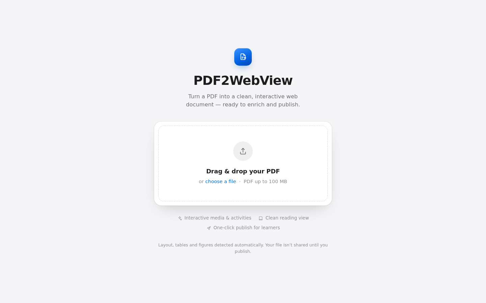

To select a source document, drag one file onto the dashed upload box or click
**choose a file** and pick it from your computer. The box also works from the
keyboard: focus it and press Enter or Space to open the file chooser. If you
need guidance before starting, the upload page's **Need help? Open the user
manual** link opens `/manual` in a new browser tab, leaving the upload page in
place.

The selected file must end in `.pdf` and be **100 MB or smaller**. Validation
happens before upload: a different extension produces *"That doesn't look like
a PDF. Choose a file ending in .pdf."*, while an oversized file is named and
reported as being over the 100 MB limit. In either case nothing is uploaded,
and **Try again** returns you to file selection.

After validation, the progress area names the file and reports the amount sent,
the total size, and the upload percentage. **Cancel** stops an upload that is
still being transferred and returns the page to its starting state. When the
transfer reaches the server, the message changes to *"Upload complete —
starting conversion…"* and the bar becomes indeterminate while the chapter is
being processed; page and image counts appear as they become available.

Conversion detects layout, tables, and figures automatically. Text-based PDFs
usually finish faster, while scans or photographs of pages need OCR (optical
character recognition), so they can take several minutes and may not reproduce
unclear source text perfectly. After roughly six minutes the page can report
*"This is taking longer than expected. It may still finish in the background —
check back later, or try again."*; this is a recovery message, not proof that
the background job failed.

When conversion completes, a success card shows the chapter title and any
available page count, image count, and file size. **Open document** opens the
editable document in a new tab, while **Convert another** resets the upload page
for a different PDF. If conversion fails instead, the page shows **Couldn't
convert this file**, a plain-language detail, and **Try again**.

---

## 3. The document screen — what am I looking at?

After conversion, you land on the document view. This is the **read-only** view:
you can navigate and open actions, but typing does not change the chapter until
you deliberately enter edit mode.

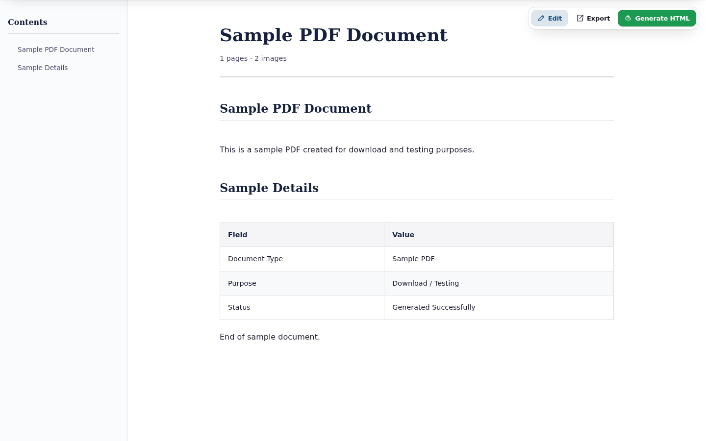

The **Contents** sidebar on the left is built automatically from the document's
headings. Choose an entry to jump directly to that part of the chapter; this is
navigation only, so it does not edit, save, or publish anything. The same
heading-based navigation is included in the learner view after publishing.

The top-right action area contains these controls:

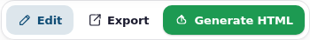

| Button | What it does |
|---|---|
| **Edit** | Switches into edit mode (see [§4](#4-editing-a-document)) |
| **Export** | Sends the current chapter to a configured Strapi or WordPress CMS |
| **Generate HTML** | Publishes the chapter for learners and gives you a shareable link (see [§10](#10-publishing-your-chapter-for-learners)) |
| **Help** | Opens this user manual at `/manual` in a new tab |

Choose **Edit** when you need to change the working document. The editor toolbar
and editable border appear, but simply entering edit mode does not save a
change; **Save** commits your work and **Cancel** lets you leave without keeping
unsaved edits.

Choose **Generate HTML** when the saved chapter is ready for learners. It opens
a publishing dialog rather than publishing immediately, so you can review the
action or press **Cancel**. Saving and generating HTML are intentionally
separate; see [§9](#9-saving-and-what-unsaved-changes-means) and
[§10](#10-publishing-your-chapter-for-learners).

Choose **Help** whenever you need the full guide without losing your place. It
opens `/manual` in a new tab. The same manual is available from **User manual**
in the editor's three-dot overflow menu and from **Need help? Open the user
manual** on the upload page; all three links leave the current page open.

### Export to CMS

Choose **Export** to copy the current chapter and its local media into an
external content management system instead of creating the normal learner link.
The **Export to CMS** dialog supports **Strapi** and **WordPress**. This is a
separate destination from **Generate HTML**: exporting does not replace the
saved working copy or count as publishing the PDF2HTML learner view.

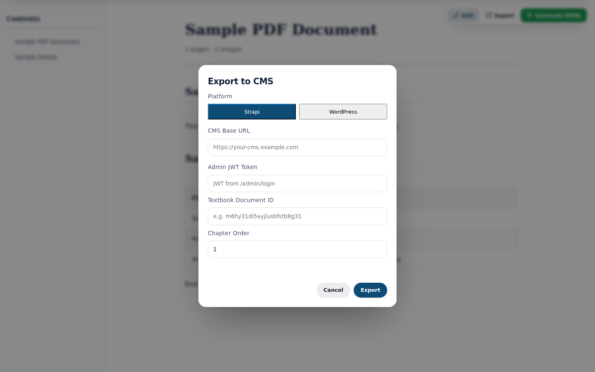

For either platform, set **CMS Base URL** to the root address of the CMS and do
not paste a page-specific editing link. For **Strapi**, enter the **Admin JWT
Token** supplied for the Strapi administrator session, the **Textbook Document
ID** of the parent textbook, and a **Chapter Order** of 1 or greater to place the
new chapter in that textbook. For **WordPress**, enter the CMS **Username** and
an **Application Password** created for that WordPress account; a successful
WordPress export creates a draft post rather than publishing it immediately.

Press **Export** to submit the chapter. Missing values are reported in the
dialog, including *"CMS URL is required"*, *"JWT token is required"*,
*"Textbook Document ID is required"*, or *"Username and password required"*.
During submission the status reads *"Exporting..."* and the **Export** button is
disabled. Success changes the status to *"Exported successfully!"* followed by
an available CMS URL and closes the dialog after a short pause; a connection,
timeout, or CMS error remains visible so you can correct the details and try
again.

Use **Cancel**, click outside the dialog, or press Esc to close without starting
an export. Closing after submission hides the dialog but does not cancel a
request already in progress. The token and application-password fields are
masked, but treat them as credentials: use an HTTPS CMS address, do not include
them in screenshots or messages, and avoid exporting on a shared screen or
computer. The form can retain entered values for the current page session, so
reload or close the page when you have finished on a shared device.

After you scroll down, a small round **Back to top** arrow appears in a bottom
corner. Activate it to return smoothly to the chapter title and top actions;
it changes only your scroll position and is also present in the published
learner view.

---

## 4. Editing a document

Click **Edit** at the top right. A formatting toolbar slides down and a dashed
blue border marks the document's editable area, making it clear that changes
can now be made.

Close-up of that toolbar:

Click in ordinary text to place the cursor and type as you would in a word
processor. To change existing text, drag across it or use your keyboard to make
a selection, then choose a toolbar format. Inserted items come from **Insert**;
the selection is preserved while you use that menu so the item is placed at
the intended position.

**Save** writes the complete current document to the working copy. The status
area beside the toolbar reports states such as *"Saving…"* and *"Saved"*, and
`Ctrl+S` (or `Cmd+S` on a Mac) performs the same action. A save persists after
you leave or reopen the page, but it does not update the learner-facing link
until you use **Generate HTML**.

**Cancel** leaves edit mode. If nothing changed, it simply returns to the
read-only document; if there are unsaved changes, the editor asks whether to
discard them:

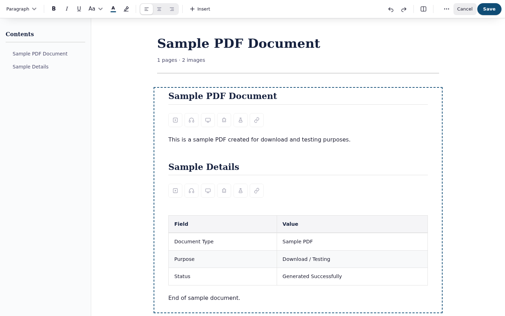

Choose **OK** to restore the last saved version and leave edit mode, or choose
**Cancel** in the confirmation to return to the editor and save first. The
three-dot menu's **Discard changes** uses the same confirmation and recovery
behavior. If you try to close or reload the browser tab while edits are
unsaved, the browser also shows its own leave-page warning; stay on the page if
you still need to save.

The editor has its own **Undo** and **Redo** history, available from the toolbar
or with `Ctrl+Z` and `Ctrl+Y` (`Ctrl+Shift+Z` also redoes). It records a snapshot
about **300 milliseconds after you stop editing**, so a burst of typing is
usually one step, and it keeps only the latest **5** snapshots. Undo moves the
current state into the equally limited redo history; making a new change after
undoing replaces that redo path.

This custom history resets whenever you enter edit mode. Saving or cancelling,
leaving edit mode, and then returning starts a new history, so an edit from a
previous session cannot be undone from the toolbar. Use undo/redo for recent
mistakes and **Save** for durable recovery rather than depending on the
five-step history.

---

## 5. The formatting toolbar, piece by piece

The toolbar is arranged from document formatting on the left to history,
comparison, status, and exit controls on the right. Most formatting applies to
the current selection or the paragraph containing the cursor, and the toolbar
is available only in edit mode.

### Text style (headings & lists)

Open the dropdown that currently says **Paragraph**, **Heading 1**, or another
block style:

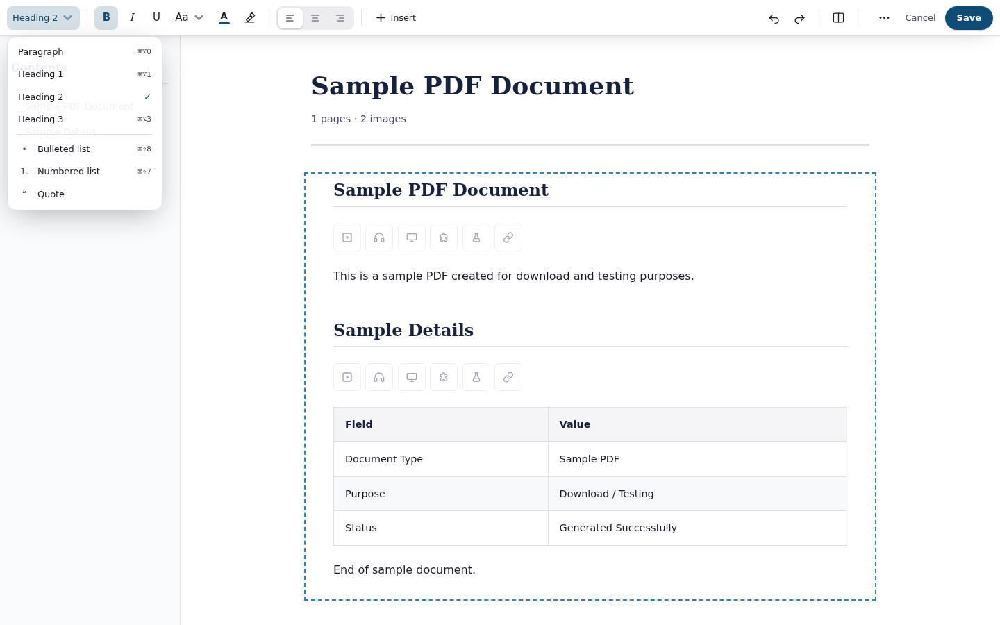

Choose **Paragraph**, **Heading 1**, **Heading 2**, **Heading 3**, **Bulleted
list**, **Numbered list**, or **Quote**. The choice changes the complete line or
paragraph containing the cursor; headings also affect the automatically built
**Contents** navigation, so use them for real section structure rather than
only to make text look larger.

### Bold, Italic, Underline

Select text and choose **B**, **I**, or **U** to apply **Bold**, **Italic**, or
**Underline**; use the same button again to remove that format. The equivalent
shortcuts are `Ctrl+B`, `Ctrl+I`, and `Ctrl+U` (or `Cmd` on a Mac), and the
format is retained when you save and included the next time you publish.

### Aa — more formatting

The **Aa** menu holds **Strikethrough**, **Superscript**, and **Subscript**.
Select the characters first, then choose the option; superscript and subscript
are useful for exponents, references, and scientific notation, while
strikethrough visibly marks text without deleting it. Reapply an active option
to remove it.

### Text color

Select text, then choose the **A** with a colored underline to open five preset
colors and a custom color picker:

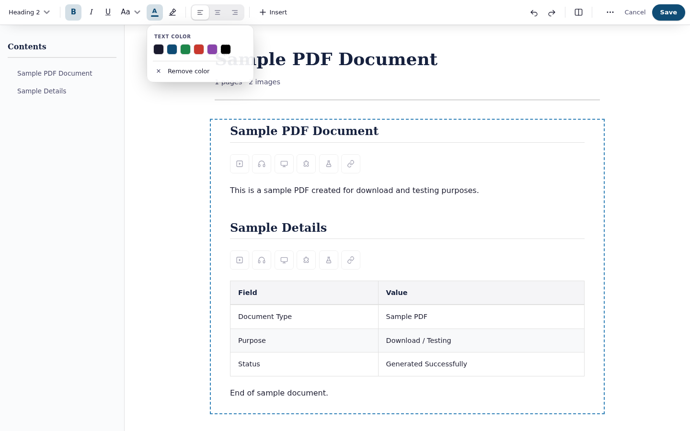

Choosing a swatch changes the selected text and **Remove color** returns it to
the document's default color. Check contrast against both light and dark reader
themes before publishing; color should support, not replace, the words needed
to convey meaning.

### Highlight — Marker and Text gradient

Select text and choose the highlighter icon:

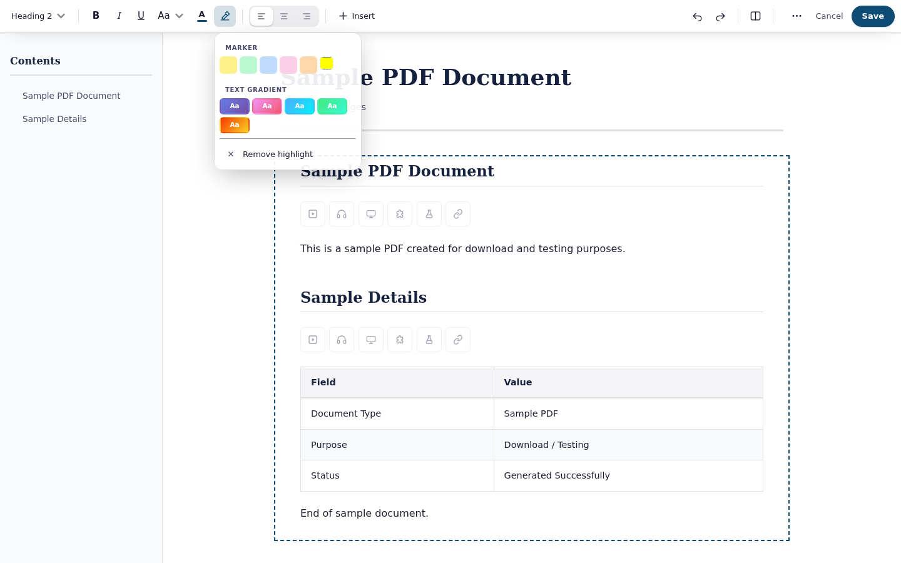

**Marker** applies one of five flat background colors or a custom fill, like a
physical highlighter. **Text gradient** applies one of five decorative color
gradients to the letters themselves and is best used sparingly for short
headings. **Remove highlight** clears either treatment; because decorative
color can be difficult to read in some themes, do not use it as the only signal
that content is important.

### Alignment

Place the cursor in a paragraph or select the paragraphs to change, then choose
**Align left**, **Align center**, or **Align right**. Alignment is stored with
the saved document and appears in the published chapter; use left alignment for
most reading text because centered or right-aligned long passages are harder to
scan.

### Insert

Choose **Insert** to open the searchable menu for media, activities, blocks,
reference tools, formulas, and symbols. It inserts at the saved cursor position,
and each item has its own dialog and **Cancel** path; [§6](#6-inserting-things-the-insert-menu)
explains every choice.

### Undo / Redo

The two arrow buttons step backward or forward through the editor's custom
five-snapshot history. They match `Ctrl+Z` and `Ctrl+Y`, become useful only after
a change, and do not reach edits from an earlier edit session; see [§4](#4-editing-a-document)
for the timing and reset rules.

### Split view

Choose **Split view** to place the preserved original PDF pages beside the
editable web document. Use the source side for visual comparison while changing
the converted side, then choose **Split view** again to return to the normal
width. It does not modify either version and is intended for checking conversion
accuracy before saving or publishing.

### Save status

The small status label reports what happened to the latest save, including
states such as *"Saving…"* and *"Saved"*. Wait for the saved confirmation before
closing or reloading the page; the label describes the working copy only and is
not evidence that **Generate HTML** has updated the learner link.

### The “⋯” (more options) menu

Choose the three dots near the right edge:

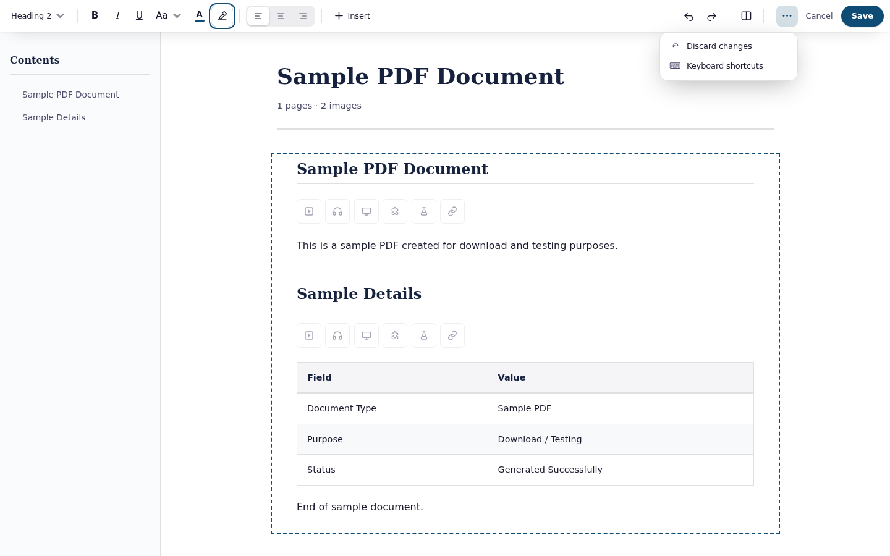

**Discard changes** restores the last saved version after confirmation, making
it the recovery option when the current editing session has gone wrong.
**Keyboard shortcuts** opens the compact reference without leaving the editor:

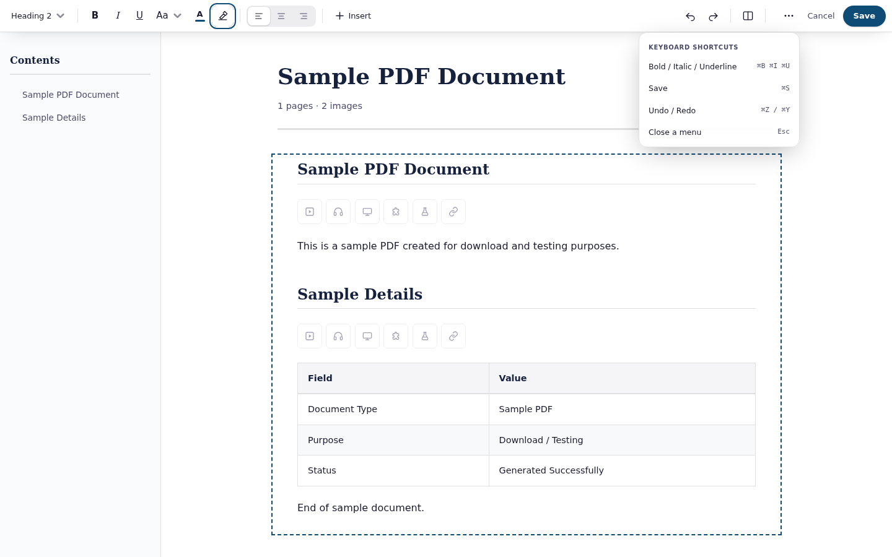

**User manual** opens `/manual` in a new tab, just like the top **Help** button
and the upload page's **Need help? Open the user manual** link. Opening the guide
does not save, discard, or publish your current work, so return to the editor
tab and save when ready.

### Cancel and Save

At the far right, **Cancel** exits edit mode and warns before discarding unsaved
changes, while **Save** persists the current working document and reports its
status in the toolbar. Neither control publishes; use **Generate HTML** from the
read-only view only after the saved chapter is ready for learners.

---

## 6. Inserting things: the Insert menu

Click **Insert** in the edit toolbar. A searchable panel drops down:

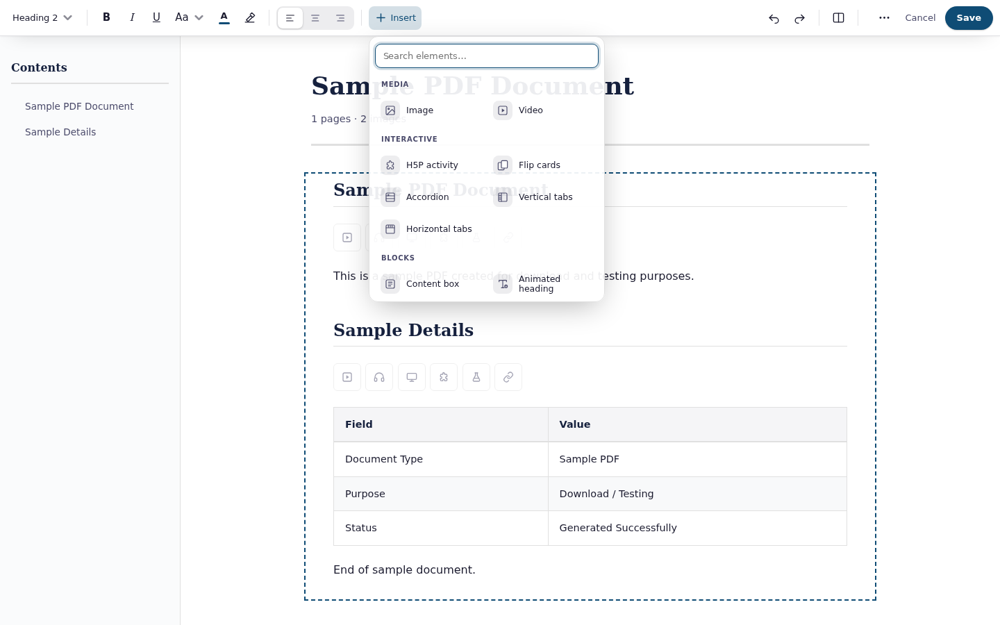

Type into the search box to filter (e.g. typing "form" jumps straight to
"Formula"):

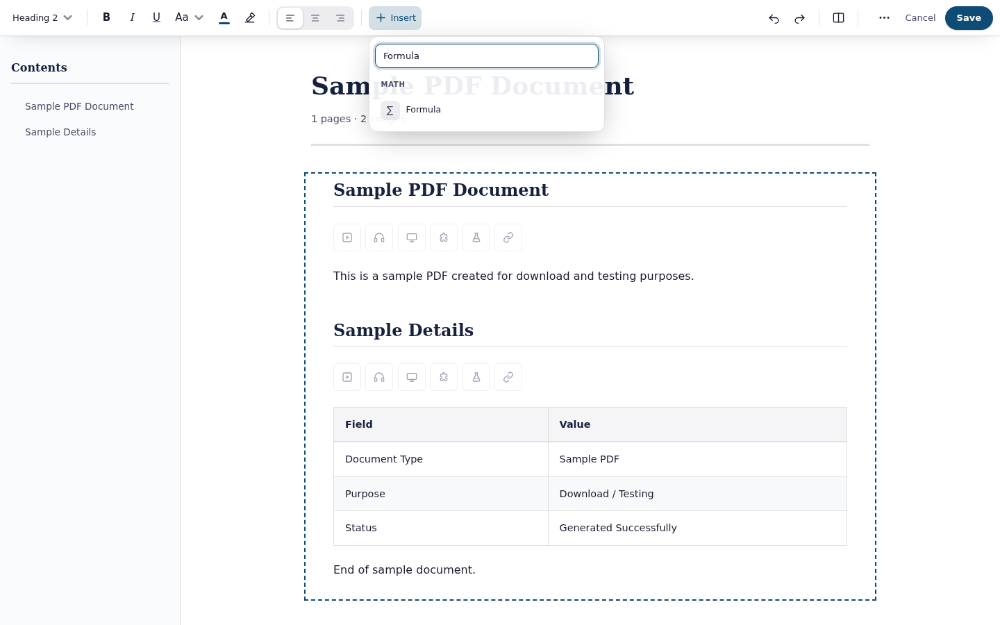

Everything you can insert is grouped into five categories: **Media**,
**Interactive**, **Blocks**, **Reference**, and **Math**. Here's what each one
does and what its dialog looks like.

> **After inserting:** almost everything you insert can be **double-clicked**
> later to re-open its settings and change what you typed — you don't have to
> delete and re-insert to make an edit.

### Image
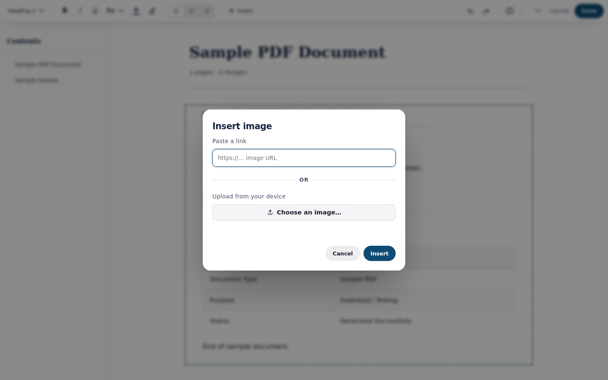

Paste a direct image URL, **or** click "Choose an image…" to upload a file
from your computer (PNG or JPG, up to **1 MB**). After it's placed in the
document, double-click it to add a caption/description — good practice for
accessibility (screen readers read that description aloud).

### Video
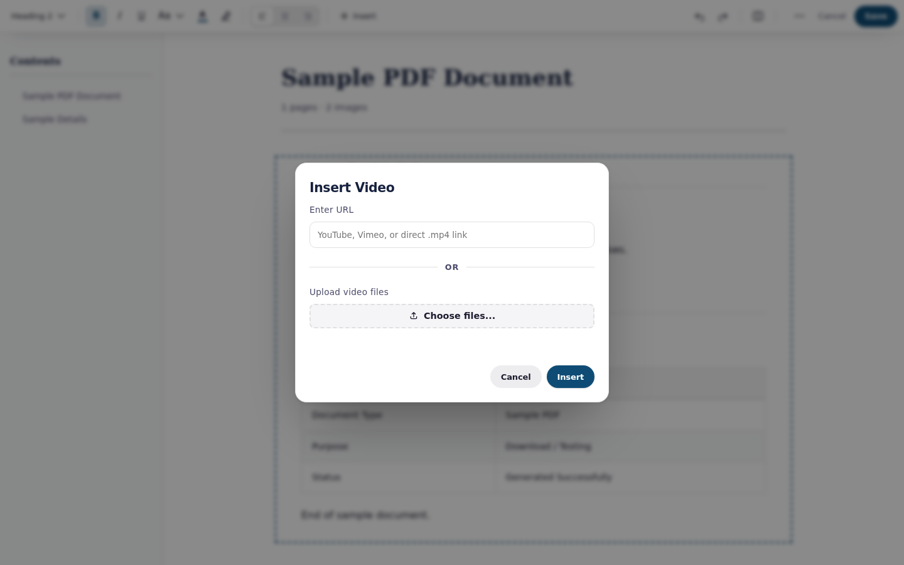

Paste a YouTube, Vimeo, or direct `.mp4` link, **or** upload your own video
file (up to **1.2 GB**, multiple files at once). Videos are shown with a full video player once published, and remember where a learner paused if they come back later. Insert the player at the cursor and save the document; if you uploaded a local file, run **Generate HTML** again so that file is available from the learner link.

### H5P activity
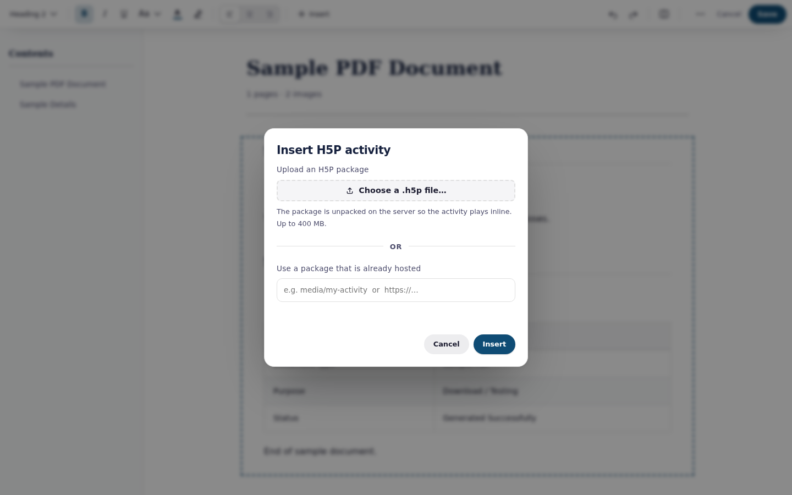

H5P is a format for interactive exercises (quizzes, drag-and-drop, timelines,
etc.) usually built in a separate H5P authoring tool and exported as a `.h5p`
file. Upload that file here (up to **400 MB**), or point to one that's already hosted somewhere. Inserting adds the activity at the cursor; save and republish before testing it from the learner link, and use **Cancel** if you do not want to add the selected package or URL.

### Flip cards
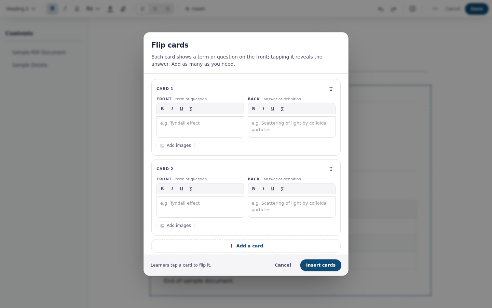

Good for vocabulary or quick-recall questions. Each card has a **front** (the
question/term) and a **back** (the answer/definition) — learners tap a card to
flip it. Click **Add a card** for more, and you can add an image to either face. **Insert cards** places the deck at the cursor; after saving and publishing, learners click or press Enter/Space on a focused card to reveal the back.

### Accordion
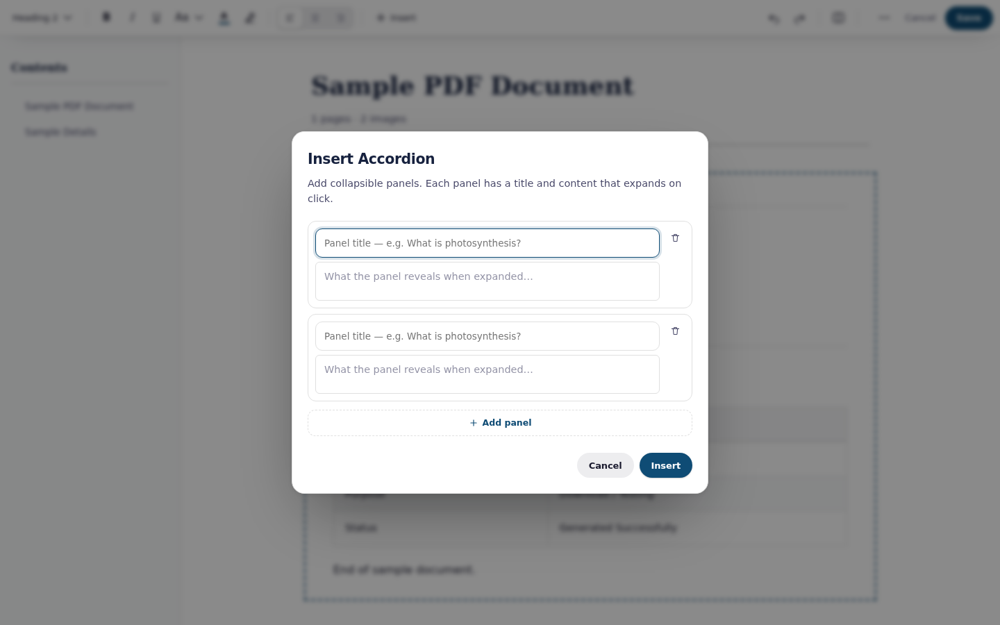

A stack of collapsible panels — good for FAQs or "click to reveal" content.
Each panel needs a title and the content it reveals when clicked. Insert the completed stack at the cursor and save it; in the learner view, choosing a panel expands its content and choosing it again collapses it.

### Vertical tabs
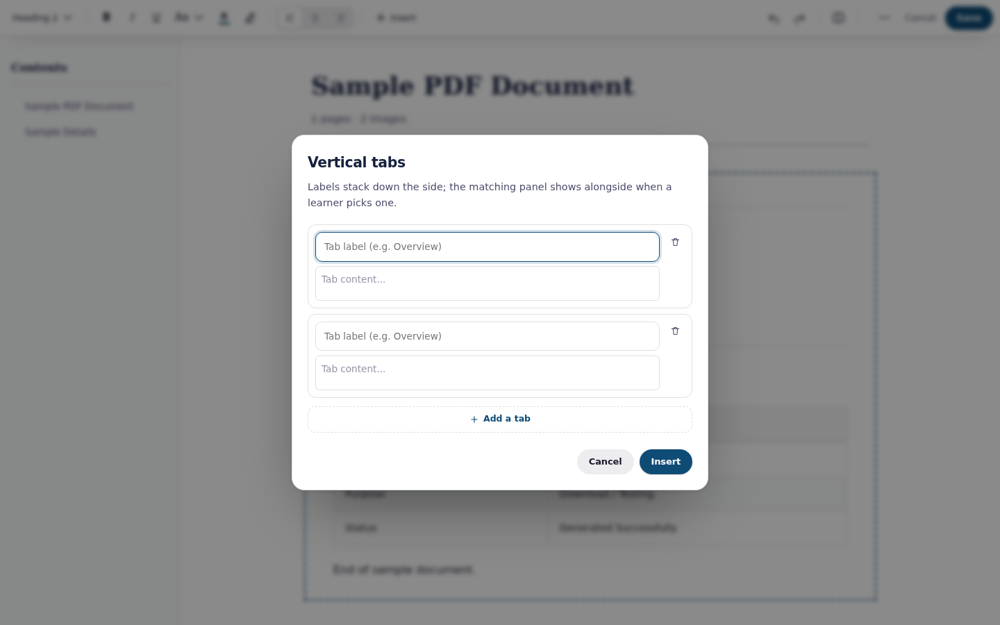

Tab labels run down the left side; add each label and its content in the dialog, then insert and save the block. Learners click a label to show its content next to it, which makes this layout useful for comparing several related topics without creating separate pages.

### Horizontal tabs
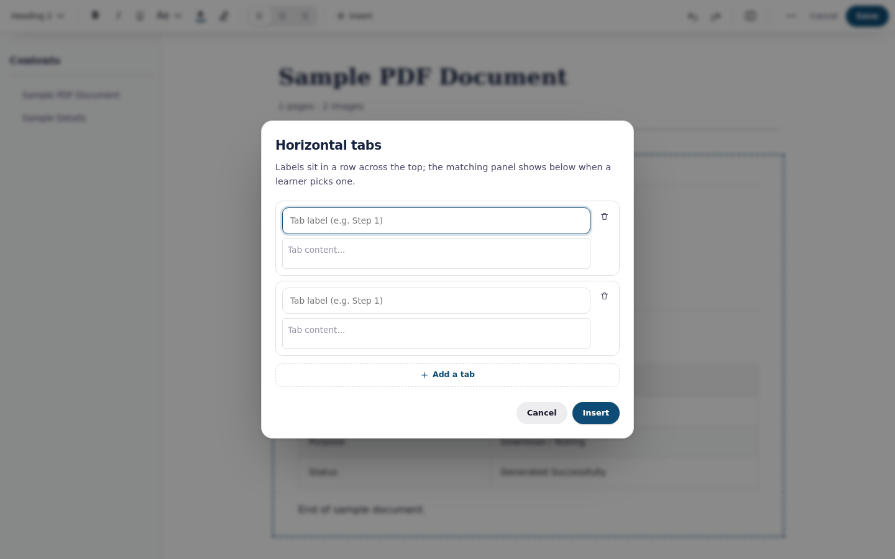

Same idea as vertical tabs, but the labels run across the top in a row. Add the labels and content in the dialog, insert the block at the cursor, and save before publishing; learners choose a top-row tab to reveal its associated panel without leaving the page.

### Content box
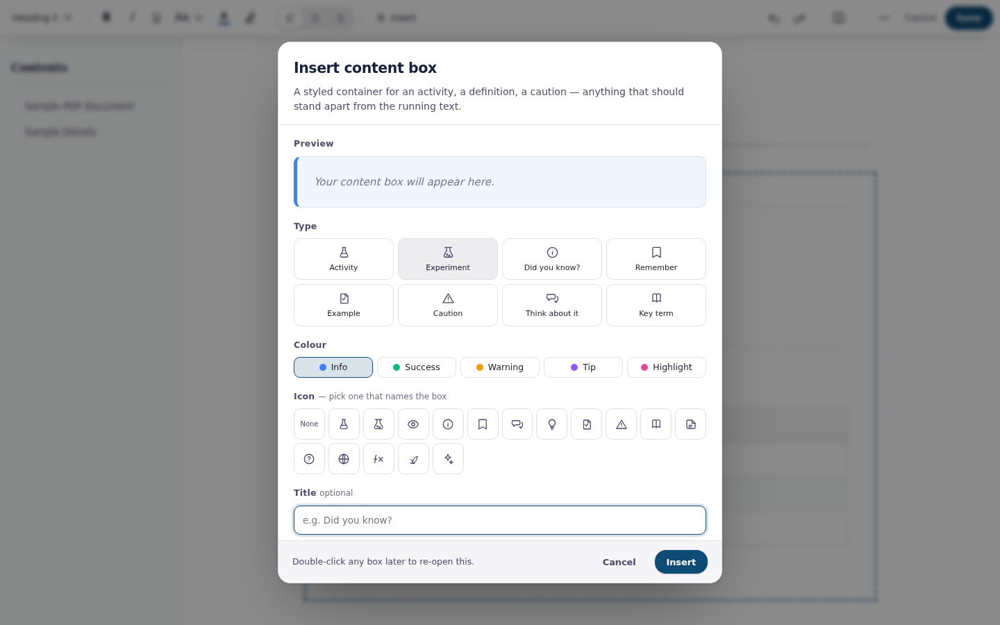

A styled callout box for anything that should visually stand apart from the
regular paragraph text — a definition, a safety warning, an activity
instruction, a "did you know?" aside, etc. You can:
- Pick a **Type** preset (Activity, Experiment, Did you know?, Remember,
  Example, Caution, Think about it, Key term) — this just pre-fills a
  reasonable color/icon combination, you can still change them.
- Pick a **Colour** (Info/Success/Warning/Tip/Highlight).
- Pick an **Icon** from the grid, or none.
- Give it an optional **Title**.
- Type the box's content in the editable area.
- Optionally add an image inside the box.

Live preview at the top of the dialog updates as you type. Insert the finished box at the cursor and save it; the chosen title, icon, colour, text, and optional image then appear together as one callout in the learner view.

### Animated heading
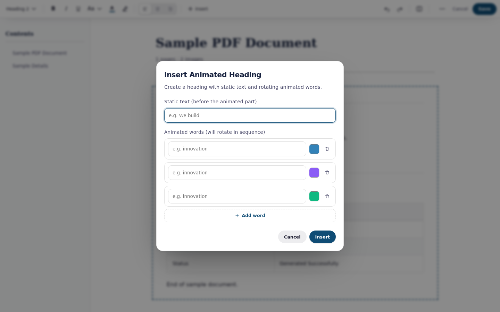

A heading where part of the text stays fixed and the rest **rotates through a
list of words** with a fade animation — e.g. "We build ___" cycling through
"innovation / community / knowledge". Type the fixed text, then add each rotating word (each can have its own color). Insert and save the heading to keep it; the learner view cycles through the rotating words, while the fixed wording provides the surrounding context.

### Shape divider
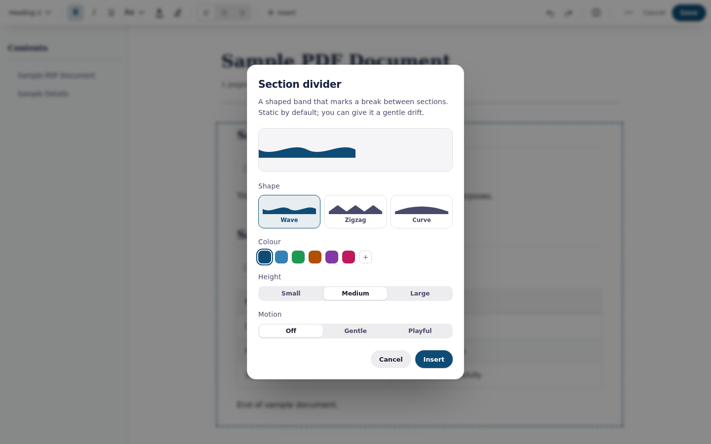

A decorative wave/zigzag/curve band to visually separate two sections. Choose
the shape, a color, a height (Small/Medium/Large), and whether it should gently animate (**Motion**: **Off**, **Gentle**, or **Playful**). Insert and save the divider between the intended sections; it is decorative, so nearby headings or text should still explain the structure to learners.

### Glossary
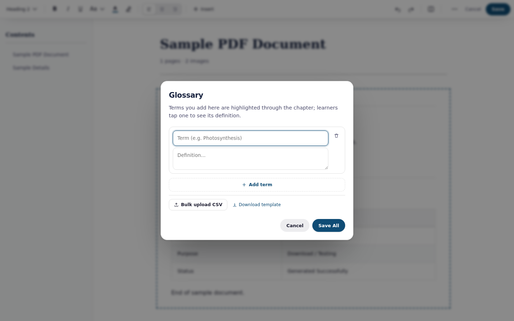

This is chapter-wide, not a single insertion — it manages every glossary term
for the whole document, and it's the same dialog whether you're adding your
first term or your fiftieth. There are two ways to get terms into it:
**typing them in one at a time**, or **bulk-uploading a CSV file**. Both end
up in the exact same list, and both get **highlighted the same way** once
saved — the difference is purely about *how you get the terms into the list*,
not how they behave afterward.

#### How glossary highlighting actually works

However a term gets into the list, here's what happens once you click
**Save All**:

1. The tool searches the **entire chapter's text** for that exact word or
   phrase, matching **whole words only** (so "cell" won't match inside
   "cellular") and **case-insensitively** (so "Photosynthesis" in your
   glossary matches "photosynthesis" in the text too).
2. **Every** matching occurrence in the chapter gets wrapped with a dotted
   underline — not just the first one. If a term appears 12 times in the
   chapter, all 12 get the tooltip treatment.
3. It skips text inside headings, code blocks, links, and buttons — so a term
   accidentally matching part of a heading or a button label won't get
   highlighted there.
4. If two glossary terms overlap (e.g. "carbon" and "carbon dioxide"), the
   **longer phrase wins** — "carbon dioxide" gets highlighted as one term
   rather than "carbon" being highlighted inside it.
5. Hovering or tapping a highlighted term shows its definition in a small
   popup, both while you're editing and in the final published view.

#### Manual entry (typing terms in)

Use manual entry when you need to add or revise a small number of terms directly
inside the chapter. Choose **Add term**, enter the **Term** and
**Definition**, and repeat as needed; review the list, remove any unwanted rows,
and choose **Save All** to apply the definitions throughout the chapter. Manual
entry accepts a valid term even when it is not present in the current text, so
check spelling if no dotted underline appears after saving.

- Click **Add term** to get a new blank row, fill in the **Term** and its
  **Definition**, repeat for as many terms as you need.
- Good for adding a handful of terms, or fixing/wording a definition exactly
  the way you want.
- There's no live check while typing that the term actually appears in the
  chapter — you can save a term that doesn't exist in the text; it simply
  won't visually highlight anywhere (harmless, but worth double-checking the
  spelling matches the chapter if a term isn't lighting up as expected).

#### Bulk CSV upload

Use bulk CSV upload when a larger term list already exists in a spreadsheet or
has been prepared by a subject-matter expert. Choose **Download template** to
start with supported columns, select **Bulk upload CSV**, and review the import
summary and editable rows before choosing **Save All**. The import adds valid,
non-duplicate terms found in this chapter without replacing existing entries,
so skipped rows can be corrected and imported later without losing prior work.

- Click **Bulk upload CSV** and choose a `.csv` file. Click **Download
  template** first if you want a starter file with the exact column
  format (`term,definition`) and a few example rows already filled in as a
  guide.
- The CSV needs two columns: **term** and **definition**. A header row
  (`term,definition`, or `word,meaning`, or `keyword,description`) is
  automatically detected and skipped if present — you don't need to remove it
  yourself.
- **Unlike manual entry, the CSV import checks each term against your
  chapter's actual text before adding it** — this is the key difference.
  For every row in the file, one of four things happens, and you get a
  summary of exactly what happened after the upload:
  | Outcome | Why | What you see |
  |---|---|---|
  | **Added** | Term is 2+ characters, has a definition, and is found somewhere in the chapter's text | Counted in "✓ Added N terms from CSV" |
  | **Skipped — not found** | Term isn't found anywhere in the chapter's text (often a typo, or a term meant for a different chapter) | Listed under "⚠ Skipped N terms not found in this chapter" |
  | **Skipped — duplicate** | You already have that exact term (case-insensitive) in the list, either typed in manually or from an earlier CSV row | Listed under duplicates |
  | **Skipped — invalid** | The term is under 2 characters, or the definition column is empty | Listed under invalid rows |
- Terms added via CSV land as ordinary rows in the same list — after import,
  you can still edit, delete, or add more terms manually before clicking
  **Save All**. Nothing is final until you save.
- CSV import is **additive**, not a replacement: uploading a CSV never
  deletes or overwrites terms already in the list, it only adds new ones on
  top (skipping exact duplicates, as above).

**When to use which:** manual entry is best for a handful of terms or when
you want full control over exact wording as you go. CSV bulk upload is best
when you (or someone else) has already prepared a list of terms and
definitions elsewhere — e.g. a spreadsheet a subject-matter expert filled in
— since it saves you from retyping everything, and its built-in "not found in
this chapter" check catches typos/mismatches you might otherwise miss with
manual entry.

### Formula (math/chemistry)
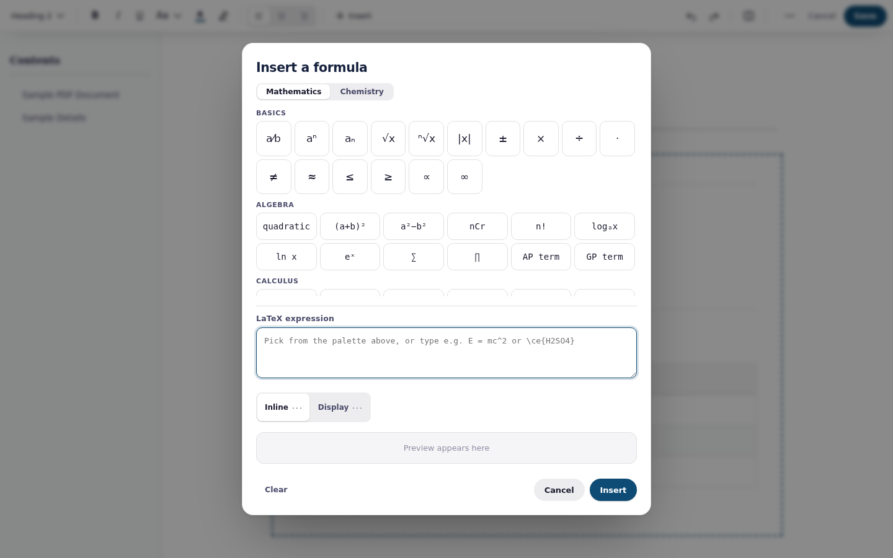

For equations and chemical formulae. Two tabs — **Mathematics** and
**Chemistry** — hold click-to-insert templates for common expressions
(fractions, exponents, quadratic formula, common reactions, etc.). You can
also type raw LaTeX directly into the text box (e.g. `E = mc^2` or
`\ce{H2SO4}` for chemistry). Choose **Inline** (sits within a line of text) or
**Display** (its own centered line), and the box below shows a live preview
before you insert. **Insert** places the rendered expression at the cursor and **Cancel** leaves the document unchanged; save and publish to carry the equation into the learner view.

### Symbol
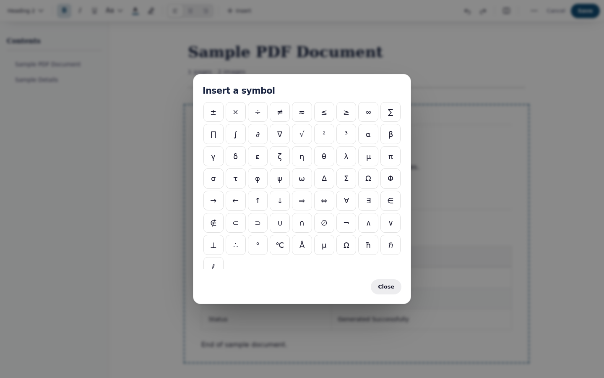

A grid of math/science symbols (±, ≈, ∞, Greek letters, arrows, set notation,
°C, etc.) for quick one-click insertion into your text — no LaTeX needed for
these. Click a symbol to insert it immediately at the current cursor position; click **Close** when done. The inserted character behaves like ordinary text, so it can be selected, formatted, saved, and published with the surrounding sentence.

---

## 7. Adding a video/audio/slide-deck to a section

Separate from **Insert**, every heading gets a small media-attachment icon row
under it while you are editing:

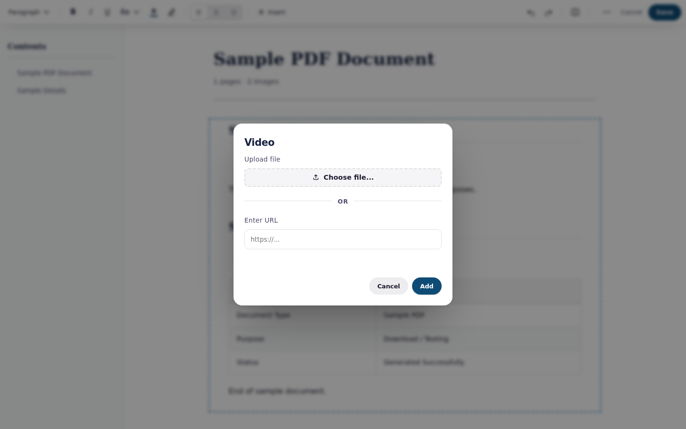

These controls attach supplementary material to that specific section rather
than placing a player in the running text. Choose the appropriate icon, then
use the **Add Media** dialog to upload a supported file or enter a URL and press
**Add**. **Cancel** closes the dialog without changing the section. Once saved,
a filled or colored icon indicates an attachment; outside edit mode, choosing
that icon opens the material in an overlay.

**Video** attaches a lecture, demonstration, or other video to the current
heading. Upload any video format up to **1.2 GB** or provide a suitable URL;
after saving and publishing, the section icon opens a video player so the
learner can watch without leaving the chapter.

**Audio** attaches a recording up to **50 MB**, such as narration,
pronunciation, or an interview. Add the file or URL to the intended heading and
save it; the learner opens the section's audio control in the media overlay and
uses its playback controls.

**Presentation** attaches a `.pptx`, `.ppt`, `.pdf`, or `.odp` slide deck up to
**30 MB**. Use it when the slides supplement one section, not the whole running
text; after saving and republishing, learners open the presentation from that
section's attachment icon.

**H5P Content** attaches an `.h5p`, `.html`, or `.zip` activity up to **400 MB**
to the heading. This differs from **Insert → H5P activity** only in placement:
the section icon opens the attached activity in an overlay rather than placing
it directly between paragraphs.

**Virtual Lab** accepts a `.zip` bundle up to **300 MB** and associates the lab
with the current section. The bundle must be usable as a self-contained lab;
after it is accepted, save and publish so learners can launch it from the
section's media controls.

**URL Link** stores a web address for the section and has no file-size limit.
Enter the complete link in **Enter URL**, add it, and save; learners use the
section icon to open the linked resource, so check the address and access
permissions before sharing the chapter.

| Media type | Typical file types | Size limit |
|---|---|---|
| Video | any video format | 1.2 GB |
| Audio | any audio format | 50 MB |
| Presentation | `.pptx`, `.ppt`, `.pdf`, `.odp` | 30 MB |
| H5P Content | `.h5p`, `.html`, `.zip` | 400 MB |
| Virtual Lab | `.zip` bundle | 300 MB |
| URL Link | any web link | — |

Adding an attachment and clicking **Save** updates only the working chapter.
Use **Generate HTML** again after adding or replacing local media so the public
learner version receives those files; if an icon is filled but the public link
still lacks the media, saving without republishing is the first thing to check.

---

## 8. Making a diagram interactive (AI hotspots)

In edit mode, hover over a converted diagram image to reveal **Make
Interactive**. Choose it to start AI-based text-label detection; the control
changes to *"Analyzing…"* while the image is examined. This is designed for
clear printed labels such as the named parts of a scientific diagram, and it
does not alter the preserved source PDF.

When analysis succeeds, the editor places small hotspot regions over the labels
it detected. Save the document and publish it as usual. In the learner view,
each region can be clicked or reached with the Tab key, and activating or
hovering it shows a short definition; that definition is fetched from Wikipedia
the first time it is needed.

Hotspot results depend on readable labels and network access for the definition.
Handwriting, low-resolution text, photographs without labels, or a diagram with
no detectable words may produce no useful regions, and a learner may not see a
definition if the external lookup is unavailable. Review the result before
publishing rather than assuming every label was detected correctly.

If analysis fails, the control briefly displays an error and returns to **Make
Interactive**, so you can try again and the rest of the document remains
usable. A failed attempt does not damage the image; leave it as a normal image
or improve the source outside the app and convert a clearer version if repeated
attempts cannot read the labels.

---

## 9. Saving, and what “unsaved changes” means

**Save** in the edit toolbar (or `Ctrl+S`/`Cmd+S`) writes the current editor
contents to the document's working copy. Wait for the toolbar status to confirm
*"Saved"*. That saved version remains when the document is reopened and is the
version available for later editing, comparison, export, or publishing.

An unsaved change is anything altered since the last successful save: typing,
formatting, deleting, inserting a block, changing glossary entries, or adding
section media. **Cancel**, **Discard changes**, reloading, or closing the tab can
therefore lose it. The app asks before discarding in edit mode, and the browser
shows its own warning when you attempt to leave with unsaved changes; choose to
stay if you need to save first.

Saving is not publishing. **Save** updates the private working document, while
**Generate HTML** packages the saved chapter and referenced files for the
learner-facing link. Save repeatedly while authoring, review in read-only or
split view, and publish only when the learner version should change. After new
local media is added, both steps matter: save the chapter, then generate HTML
again so the file is copied to public storage.

Undo/redo is not a substitute for saving. Its five-snapshot history resets when
an editing session ends, whereas a successful save is durable. If you discard
an editing session, the editor restores the last saved document; if another
person saved the same chapter after you opened it, coordinate before saving
because the last save wins.

---

## 10. Publishing your chapter for learners

From the normal non-editing document view, choose the green **Generate HTML**
button. The initial publishing state explains the action and offers **Generate
now** and **Cancel**:

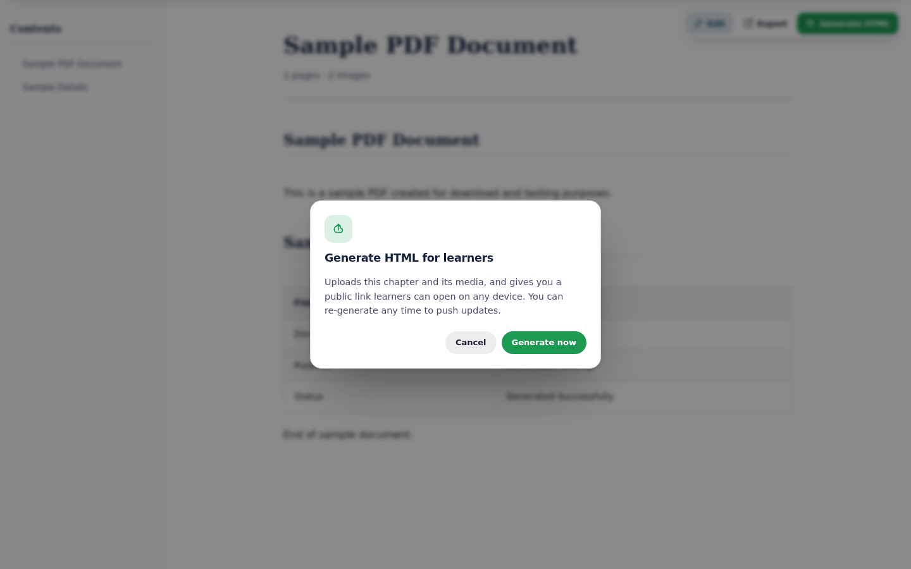

**Cancel**, clicking the backdrop, or closing the dialog at this idle stage
leaves the existing learner version unchanged. Choose **Generate now** only
after saving the edits you intend to share. The dialog then switches to a
progress state and reports *"Uploading files…"* while it sends the chapter HTML
and referenced images, videos, and attachments to public storage.

On success, the dialog displays the public URL and, when available, counts of
uploaded media and videos. **Copy** places the URL on the clipboard and briefly
changes its label to *"Copied"*; **Open** launches the published chapter in a
new tab, and **Close** dismisses the success state. Open the link once yourself
to check content, media, and interactions before distributing it.

On failure, the dialog switches to an error state. **Retry** runs the publish
operation again, while **Close** leaves the dialog so you can check the saved
document or contact an administrator. Two safe editor-facing messages are
*"This document could not be found on the server."* and *"Couldn't generate
the HTML for learners. Please try again — the server log has the details."*;
a network failure can also be shown directly. These messages do not erase the
working document.

You can publish repeatedly. Generating HTML after later saved edits updates the
same learner link rather than requiring a new link, so an address already
shared continues to work with the newest published version. Until you run
**Generate HTML** again, saved edits and newly attached local files remain only
in the working copy and learners continue to see the previous publication.

---

## 11. What a learner sees when they open the published link

A published link opens a clean reading view without authoring controls. Learners
can read on a phone, tablet, or computer, and their personal reader settings do
not edit the chapter or change what another learner sees.

The **Contents** sidebar uses the published headings to navigate the chapter:

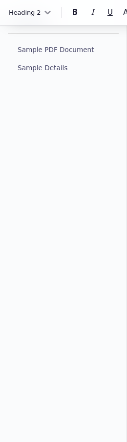

A learner chooses a heading to jump to that section. This is why meaningful
heading styles in the editor matter; Contents remains navigation only and does
not change the learner's text or notes.

The reader toolbar provides text-size controls and a **Sans**/**Serif** font
choice. Learners can make text easier to read without changing the content or
the copy seen by anyone else, and the selected presentation applies to the
reading view rather than the source document.

The **Light**, **Dark**, and **Auto** theme choices change page colors. **Auto**
follows the device's current appearance, while the explicit choices let the
learner override it. Authors should therefore avoid color-only instructions and
check that custom text colors and highlights remain legible in both light and
dark themes.

With **Notes** enabled, a pencil/plus control appears beside headings. A learner
uses it to write a personal note for that section; the note is stored only in
that browser, is not sent to the author or other learners, and can remain
available without an internet connection. It does not follow the learner to a
different browser or device and disappears if that browser's stored data is
cleared.

The **Bookmark** button manually records the current reading position so the
learner can return to it. The reader also saves position automatically every
**10 seconds** and scrolls back to that location on a later visit. Manual and
automatic positions are browser-local, so private browsing, another device, or
cleared browser data starts without the old position.

Published **Glossary** terms have a dotted underline. Hovering with a pointer or
tapping a term shows the definition created by the author; all matching
occurrences behave the same way, including terms imported from CSV after they
were saved. If a defined term never appears in the chapter text, there is
nothing to highlight.

The learner **Back to top** button appears after scrolling and returns to the
chapter title and reader controls. It does not clear notes, the bookmark, or
reading preferences, and the automatically saved position continues to update
as the learner reads.

Interactive blocks keep the behavior previewed by the author: **Flip cards**
reveal their backs, **Accordion** panels expand and collapse, and **Vertical
tabs** or **Horizontal tabs** switch between panels. Animated headings and
shape dividers provide their configured visual effect, while formulas and
symbols render as chapter content. These blocks require no learner editing or
special setup after publishing.

Inserted video/H5P content and per-section media attachments open with their
appropriate player, activity, overlay, or link. A locally uploaded item must
have been included in the most recent **Generate HTML** run; external media and
URL links also depend on the external host remaining available and allowing the
learner access.

Keyboard users can move through links, controls, tabs, cards, attachments, and
interactive diagram hotspots with Tab and Shift+Tab, then activate focused
controls with Enter or Space where supported. Dialogs and popovers can be
closed with Esc, and visible focus plus labels support orientation. Learners
should not need a mouse to reach the chapter's main navigation and interactive
controls.

---

## 12. Keyboard shortcuts cheat sheet

The editor shortcuts below work while **Edit** mode is active and the document
or toolbar has focus. They provide the same result as the labeled controls, and
**Keyboard shortcuts** in the three-dot menu opens an on-screen reminder without
changing the document.

| Shortcut | Action |
|---|---|
| `Ctrl+B` | Apply or remove Bold on the selection |
| `Ctrl+I` | Apply or remove Italic on the selection |
| `Ctrl+U` | Apply or remove Underline on the selection |
| `Ctrl+S` | Save the working document without publishing |
| `Ctrl+Z` | Undo within the current five-snapshot editing history |
| `Ctrl+Y` (or `Ctrl+Shift+Z`) | Redo within the current editing history |
| `Esc` | Close the currently open menu, popover, or dialog |

On a Mac, use `Cmd` instead of `Ctrl`. Esc follows the same cancellation path as
the open dialog's **Cancel** or **Close** control and returns focus to where you
were when possible. Shortcuts do not bypass confirmations, increase the
five-step undo limit, or make **Save** publish the chapter.

---

## 13. File size limits

The app checks each upload against the limit for that kind of content. The
source PDF is validated on the upload page before transfer, while editor media
is checked when it is selected; a rejected file is not attached or published,
and the rest of the saved chapter remains available.

| What you're uploading | Maximum size |
|---|---|
| The source PDF (on the home page) | 100 MB |
| Video | 1.2 GB |
| H5P activity package | 400 MB |
| Virtual Lab bundle | 300 MB |
| Presentation (PPTX/PPT/PDF/ODP) | 30 MB |
| Audio | 50 MB |
| Image (inserted via Insert → Image) | 1 MB |

When a file is too large, the app names the relevant limit, for example *"File
too large. Maximum for video is 1200 MB."* Choose a smaller or compressed file,
or use an approved hosted URL where that dialog offers one, then try again.
Changing the filename does not reduce its size, and these limits cannot be
raised from the user interface; ask an administrator if the required learning
asset cannot reasonably fit.

---

## 14. Troubleshooting — “it's not working”

**“That doesn't look like a PDF” appears when I select a file.** The upload page
requires a filename ending in `.pdf`. Check that you chose the intended file
and that a downloaded PDF was not renamed with another extension, then use
**Try again**. Renaming a non-PDF file to `.pdf` does not convert it into a PDF.

**The source PDF is rejected for size.** The home-page limit is **100 MB**, and
the error reports the selected file's size. Compress or split the source outside
the app, then select the smaller PDF; the rejected file was not uploaded.

**Upload stays at 0% or never finishes.** Check the network connection and try
again. **Cancel** aborts an upload still in progress and resets the page; after a
network error, **Try again** returns to selection. The server does not begin
conversion until the upload completes.

**The page says “Lost connection while checking status.”** The file may have
reached the server, but the browser could not retrieve the latest conversion
state. Restore the connection and try the upload page again; if the job had
already started, its output may still become available to an administrator.

**“This is taking longer than expected” appears during conversion.** This is
not necessarily a failure. Scanned or photographed pages require slower OCR,
and the background job may continue after the roughly six-minute browser
status window. Leave the tab open a little longer, check back later, or try
again rather than repeatedly refreshing during an active upload.

**Conversion ends with “Couldn't convert this file.”** Read the detail below
the heading and choose **Try again**. If a smaller, valid PDF fails repeatedly,
keep the exact message and filename for the administrator; the working area is
reset, but the original file on your computer is unaffected.

**I clicked Edit and lost formatting I expected.** Merely entering edit mode
does not save or delete content. Choose **Cancel**, then confirm **OK** only if
you want to discard this session and restore the last saved version. If you
already saved the unexpected result, undo from a new session cannot recover the
older copy, so contact an administrator before making more changes.

**I made a mistake and Undo will not go back far enough.** The custom history
keeps only five snapshots and resets on every entry into edit mode. Use
**Discard changes** to restore the last saved copy if the mistake is all within
the current unsaved session; otherwise, stop editing and ask whether a stored
backup is available.

**I cannot find an inserted item or its settings.** Double-click most inserted
elements, including images, content boxes, flip cards, tabs, and accordions, to
reopen their dialog with current values. Glossary entries are managed from
**Insert → Glossary**. If the item is attached to a heading instead of embedded
in text, use that heading's media icon row.

**An image, video, H5P package, lab, presentation, or audio file is rejected.**
Compare it with [§13](#13-file-size-limits) and the accepted types shown by the
dialog. Select a supported smaller file or an approved URL. A rejection leaves
the existing document intact, so you can cancel the dialog and continue
editing.

**Make Interactive finds no hotspots or shows an error.** Use a diagram with
clear printed labels; handwriting, photographs, low contrast, and unlabeled
images are poor candidates. The button returns to **Make Interactive** after a
failure, and the original image still works as a normal image. Definitions also
need the external lookup to be available to the learner.

**Export says a field is required.** Supply **CMS Base URL** and the platform's
credentials. Strapi also requires **Textbook Document ID** and uses **Chapter
Order**; WordPress requires **Username** and **Application Password**. Keep
credentials private, check the selected platform, and retry without posting the
secret values in a support message.

**Export reports a connection, timeout, WordPress, or other CMS error.** Verify
the base URL, network access, account permissions, and credential validity. The
error remains in the dialog so you can correct a field. A failed export does not
publish or erase the PDF2HTML working document; ask the CMS administrator for
help if valid details continue to fail.

**“Couldn't generate the HTML for learners” appears when publishing.** Choose
**Retry** once. If it continues, give the administrator the document name and
time of failure; technical details are intentionally kept in server logs rather
than shown to content editors. The saved working document is not deleted.

**“This document could not be found on the server” appears when publishing.**
The working output is no longer where the publishing process expects it. Close
the dialog and reopen the document from a valid conversion result if possible;
otherwise ask an administrator to check the job before reconverting the source.

**A published link returns 404 or shows nothing.** Confirm that **Generate
HTML** completed successfully at least once. **Edit**, **Save**, and **Export**
do not create the PDF2HTML learner link. Copy the URL again from a successful
publish dialog and test it in a new tab before sharing.

**The published link shows an older version.** Saving alone updates only the
working copy. Return to the read-only document, choose **Generate HTML**, wait
for success, and reopen the same public link; repeated publishing updates that
same address.

**A video, H5P activity, image, or section attachment is missing for learners.**
Save after adding it, then run **Generate HTML** again so local files are copied
to public storage. For a hosted URL, also verify that the external service is
online and the learner has permission to open it.

**A learner's note or bookmark disappeared.** Notes, bookmark state, reading
position, and reader preferences live in that browser. They do not follow the
learner to another device, browser, private/incognito window, or cleared browser
profile. Return to the original browser if its data is still present; the
author cannot recover browser-local notes from the server.

**A learner cannot operate an interactive item with a keyboard.** Tab to the
item and try Enter or Space; use Shift+Tab to move backward and Esc to close an
open dialog or popover. If one specific published item remains unreachable,
record the item type and browser for the administrator rather than replacing
all chapter content.

**Someone else's edits disappeared after I saved.** The app does not support two
people editing the same document at the same time. The last save wins, so stop
further edits, coordinate ownership of the chapter, and have one editor work at
a time.

---

## 15. Glossary of terms used in this app

This table explains the names used throughout the interface and this guide. It
is a terminology reference, not the chapter-wide **Glossary** authoring feature
in [§6](#6-inserting-things-the-insert-menu); use that feature when you want to
define subject terms and highlight them for learners.

| Term | Meaning |
|---|---|
| **Job** | One PDF-to-HTML conversion in progress or completed. |
| **Chapter / Document** | The converted, editable web page produced from your PDF. |
| **Working copy** | The saved editor version; it can differ from the most recently published learner version. |
| **Publish / Generate HTML** | The step that uploads your document and media to the public learner link. |
| **Export / CMS** | A separate action that sends the current chapter to a configured Strapi or WordPress content management system. |
| **H5P** | A file format/tool for building interactive exercises (quizzes, drag-and-drop, etc.), authored elsewhere and inserted here. |
| **OCR** | Optical Character Recognition — reading text out of a scanned/photographed page image. Used automatically on scanned PDFs. |
| **Hotspot** | A clickable and keyboard-reachable region placed over a diagram label by **Make Interactive**. |
| **Glossary term** | A word or phrase defined once and automatically highlighted where it appears in the chapter. |
| **Bookmark (learner)** | A learner's saved reading position, stored in that learner's browser. |
| **Note (learner)** | A learner's personal note attached to a heading, stored in that learner's browser. |
| **Split view** | An editor-only side-by-side comparison between the working document and the preserved original PDF pages. |
| **refId** | An internal reference ID used when this tool is embedded inside another system (such as a CMS iframe) to look up a specific document; most users never type it. |

---

*This manual reflects the application as of the screenshots taken on
2026‑09‑28. If a button has moved or looks different from what's pictured
here, the app has likely been updated since — the underlying steps described
should still apply.*
